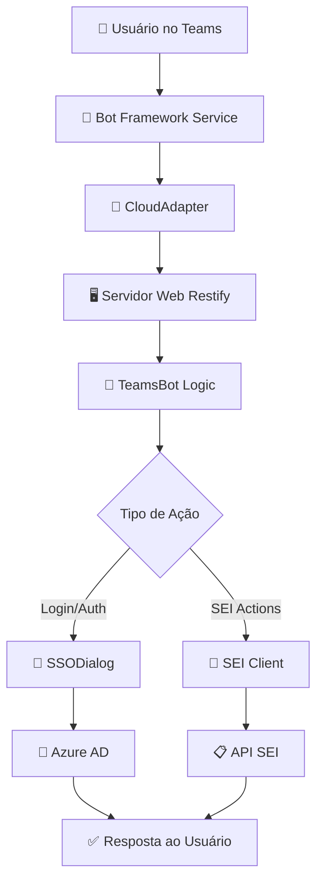
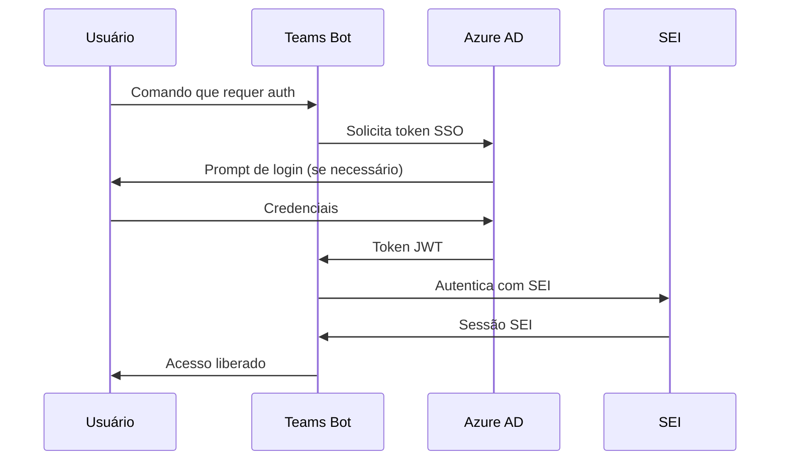

# Arquitetura Técnica

## 🏗️ Visão Geral da Arquitetura

O **Assistente SEI para Microsoft Teams** utiliza uma arquitetura desacoplada construída sobre a plataforma Microsoft Teams e Azure, garantindo manutenibilidade, escalabilidade e segurança.

### Arquitetura Multi-Tenant
A solução está sendo planejada com capacidade **multi-tenant**, permitindo no futuro atender múltiplas organizações que utilizam o SEI, cada uma com suas configurações e personalizações específicas.

---

## � Fluxo de Requisição

O fluxo de uma requisição segue o seguinte caminho:



### Detalhamento do Fluxo

1. **Cliente Microsoft Teams**: Usuário interage com o bot
2. **Bot Framework Service**: Recebe a mensagem na nuvem Microsoft
3. **CloudAdapter**: Encaminha para nosso backend
4. **Servidor Web (Restify)**: Recebe no endpoint `/api/messages`
5. **TeamsBot**: Classe principal que orquestra a conversa
6. **SSODialog**: Gerencia autenticação para fluxos complexos
7. **SEI Client**: Camada de abstração para comunicação com SEI

---

## 🛠️ Stack Tecnológico

### Backend
| Componente | Tecnologia | Versão | Função |
|------------|------------|--------|---------|
| **Runtime** | Node.js | v18+ LTS | Ambiente de execução |
| **Linguagem** | TypeScript | Latest | Desenvolvimento type-safe |
| **Servidor Web** | Restify | Latest | API REST e endpoints |
| **Bot SDK** | Microsoft Bot Builder | v4 | Framework para bots |

### Frontend/Interface
| Componente | Tecnologia | Função |
|------------|------------|---------|
| **UI Cards** | Adaptive Cards | Interface rica no Teams |
| **Modals** | Task Modules | Formulários e pop-ups |
| **Chat** | Microsoft Teams | Interface conversacional |

### Desenvolvimento
| Ferramenta | Função |
|------------|---------|
| **Visual Studio Code** | IDE principal |
| **Teams Toolkit** | Extensão para desenvolvimento |
| **Bot Framework Emulator** | Testes locais |
| **TypeScript Compiler** | Compilação do código |

---

## 📁 Estrutura do Projeto

```
projeto-sei-teams/
├── 📂 src/                          # Código-fonte TypeScript
│   ├── 📂 adaptiveCards/            # Templates de Cartões Adaptáveis
│   │   ├── welcomeCard.json
│   │   ├── processCard.json
│   │   └── signatureCard.json
│   ├── � index.ts                  # Ponto de entrada da aplicação
│   ├── 📄 teamsBot.ts              # Lógica principal do bot
│   ├── 📄 ssoDialog.ts             # Gerenciamento de autenticação
│   ├── 📄 seiClient.ts             # Cliente para API do SEI
│   └── 📄 sei-types.ts             # Definições de tipos do SEI
├── 📂 dist/                         # JavaScript compilado (auto-gerado)
├── 📂 appPackage/                   # Manifesto e recursos do app
│   ├── manifest.json               # Configuração do app Teams
│   ├── color.png                   # Ícone colorido
│   └── outline.png                 # Ícone outline
├── 📂 infra/                        # Infraestrutura como Código
│   ├── bicep/                      # Templates Azure Bicep
│   └── templates/                  # Templates de provisionamento
├── 📄 package.json                  # Dependências e scripts
├── 📄 tsconfig.json                # Configuração TypeScript
├── 📄 .env                         # Variáveis de ambiente
└── 📄 README.md                    # Documentação do projeto
```

---

## 🔧 Componentes Principais

### 1. TeamsBot (teamsBot.ts)
**Função**: Classe principal que gerencia toda a lógica da conversa e eventos do Teams.

**Responsabilidades**:
- Processamento de mensagens dos usuários
- Roteamento de comandos
- Gerenciamento de estado da conversa
- Integração com outros componentes

```typescript
export class TeamsBot extends TeamsActivityHandler {
    constructor() {
        super();
        this.onMessage(async (context, next) => {
            // Lógica de processamento de mensagens
        });
    }
}
```

### 2. SSODialog (ssoDialog.ts)
**Função**: Gerencia todo o fluxo de autenticação Single Sign-On.

**Responsabilidades**:
- Autenticação via Azure AD
- Gerenciamento de tokens
- Fluxo de login customizado para SEI
- Renovação de credenciais

### 3. SEI Client (seiClient.ts)
**Função**: Camada de abstração para comunicação com a API do SEI.

**Responsabilidades**:
- Conexão com Web Services do SEI
- Serialização/deserialização de dados
- Tratamento de erros da API
- Cache de respostas quando apropriado

**Status Atual**: Implementação mockada para desenvolvimento

### 4. Adaptive Cards (adaptiveCards/)
**Função**: Templates JSON para interface rica no Teams.

**Tipos de Cards**:
- **Welcome Card**: Tela inicial e menu principal
- **Process Card**: Exibição de detalhes de processos
- **Signature Card**: Interface para assinatura de documentos
- **Search Results**: Resultados de pesquisa formatados

---

## 🌐 Endpoints e APIs

### Endpoints do Bot
| Método | Endpoint | Função |
|--------|----------|---------|
| POST | `/api/messages` | Recebe mensagens do Bot Framework |
| GET | `/health` | Health check da aplicação |
| POST | `/auth/callback` | Callback de autenticação SSO |

### Integração com SEI
| Método SEI | Função | Status |
|------------|---------|--------|
| `consultarProcesso` | Buscar detalhes do processo | 🔄 Planejado |
| `listarDocumentos` | Listar documentos do processo | 🔄 Planejado |
| `assinarDocumento` | Realizar assinatura digital | 🔄 Planejado |
| `darCiencia` | Dar ciência em processo | 🔄 Planejado |
| `listarUnidades` | Listar unidades do usuário | 🔄 Planejado |

---

## 🔐 Segurança e Autenticação

### Fluxo de Autenticação



### Camadas de Segurança
1. **Azure AD SSO**: Autenticação primária via Microsoft
2. **Bot Framework**: Validação de origem das mensagens
3. **HTTPS**: Todas as comunicações criptografadas
4. **Token Management**: Renovação automática de credenciais
5. **Audit Log**: Log de todas as ações sensíveis

---

## � Monitoramento e Performance

### Métricas Coletadas
- **Latência de resposta** do bot
- **Taxa de sucesso** das operações SEI
- **Número de usuários ativos** por período
- **Comandos mais utilizados**
- **Erros e exceções**

### Ferramentas de Monitoramento
- **Application Insights** (Azure)
- **Bot Framework Analytics**
- **Logs estruturados** (Winston/Bunyan)
- **Health checks** automatizados

---

## 🚀 Deploy e Infraestrutura

### Ambiente de Desenvolvimento
- **Local**: Node.js + Bot Emulator
- **Ngrok**: Túnel para testes com Teams real
- **Hot Reload**: Desenvolvimento ágil com TypeScript

### Ambiente de Produção
- **Azure App Service**: Hospedagem da aplicação
- **Azure Bot Service**: Gerenciamento do bot
- **Azure Application Insights**: Monitoramento
- **Azure Key Vault**: Gerenciamento de secrets

### Infraestrutura como Código
Utilização de **Azure Bicep** para provisionamento automatizado de recursos:
- App Service Plans
- Bot Service Registration
- Application Insights
- Key Vault
- Storage Accounts

---

## � Escalabilidade e Futuro

### Arquitetura Multi-Tenant
- **Isolamento de dados** por organização
- **Configurações customizáveis** por tenant
- **Billing e usage tracking** por cliente
- **Deploy independente** de customizações

### Expansões Planejadas
- **Microserviços**: Decomposição em serviços especializados
- **Event-Driven**: Arquitetura orientada a eventos
- **API Gateway**: Centralização de APIs externas
- **Cache Distribuído**: Redis para performance
- **Message Queues**: Processamento assíncrono
